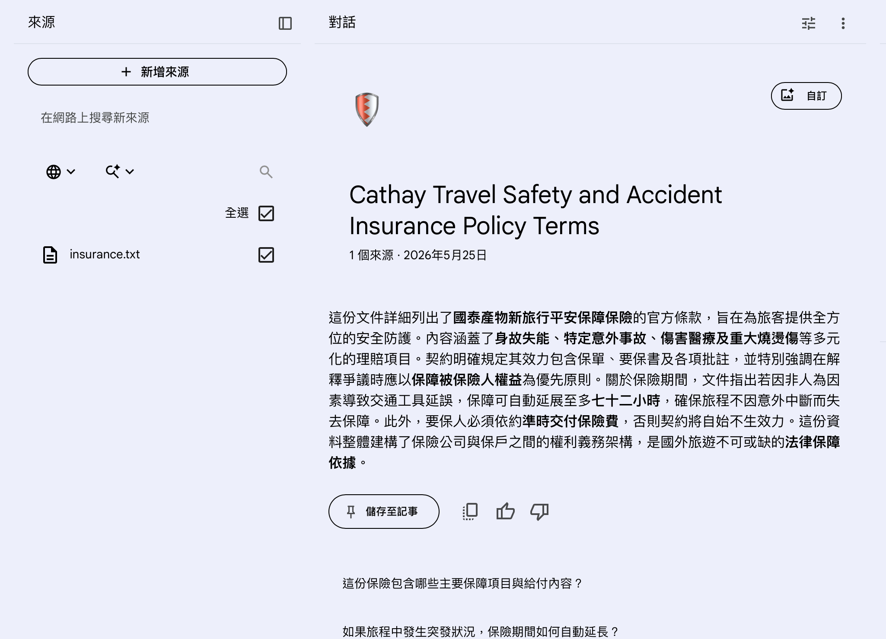
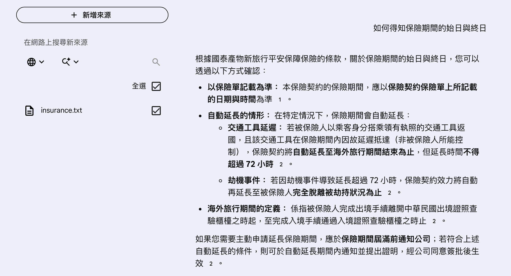

# 旅平險 AI 問答系統

使用 LangChain、FAISS 與 Qwen 建立的 RAG（Retrieval-Augmented Generation）旅平險問答系統。

---

## 專題介紹

本專題可讀取旅平險條款文件，並利用大型語言模型回答使用者問題。

系統會：

1. 讀取保險條款
2. 切分文字內容
3. 建立向量資料庫
4. 搜尋相關條款
5. 使用 AI 生成答案

---

## 使用技術

- Python
- LangChain
- FAISS
- HuggingFace Embeddings
- Qwen2-1.5B-Instruct
- Google Colab
- gradio

---

## 使用保單
- 國泰產險海外旅遊險（節錄）

---

## 如何進行預測結果的正確性驗證

驗證程式：
```
test_data = [

    {
        "question": "這份保險的免費申訴電話是多少？",
        "answer": "0800-212-880"
    },

    {
        "question": "本保險契約包含哪些承保項目？",
        "answer": "旅遊傷害保險"
    },

    {
        "question": "保險期間延長最長不得超過幾小時？",
        "answer": "七十二小時"
    },

    {
        "question": "未依約定交付保險費會如何？",
        "answer": "自始不生效力"
    },

    {
        "question": "海外旅行期間從何時開始計算？",
        "answer": "完成出境手續"
    },

    {
        "question": "重大燒燙傷保險的給付項目是什麼？",
        "answer": "重大燒燙傷保險金"
    },

    {
        "question": "保險契約解釋有疑義時應如何處理？",
        "answer": "有利於被保險人的解釋"
    }

]
```

```
correct = 0

for item in test_data:

    pred = ask(item["question"])

    if item["answer"] in pred:
        correct += 1

accuracy = correct / len(test_data)

print("Accuracy:", accuracy)
```

本系統透過 RAG 架構，
限制模型根據檢索到的條款回答，
降低大型語言模型幻覺問題。


## 安裝套件

```bash
pip install langchain
pip install langchain-community
pip install langchain-google-genai
pip install faiss-cpu
pip install pypdf
pip install gradio
pip install google-generativeai
pip install sentence-transformers
pip install transformers accelerate

```
## Colab執行過程


## 網頁demo


## notebookLM執行結果




## notebookLM與自己的系統的比較

### notebookLM：

優點
- 有整理條文
- 有分點說明
- 有解釋特殊情況
- 有摘要能力
  
還有補充：
- 自動延長情況
- 交通工具延誤
- 劫機事件
- 海外旅行期間定義
- 延長保險的條件

  

### 自己的系統：

優點：
- 回答速度快
- 有抓到關鍵句
- 介面簡潔

缺點：
- 回覆太短
- 幾乎只是直接擷取條款原文
- 沒有整理重點
- 沒有補充例外情況


