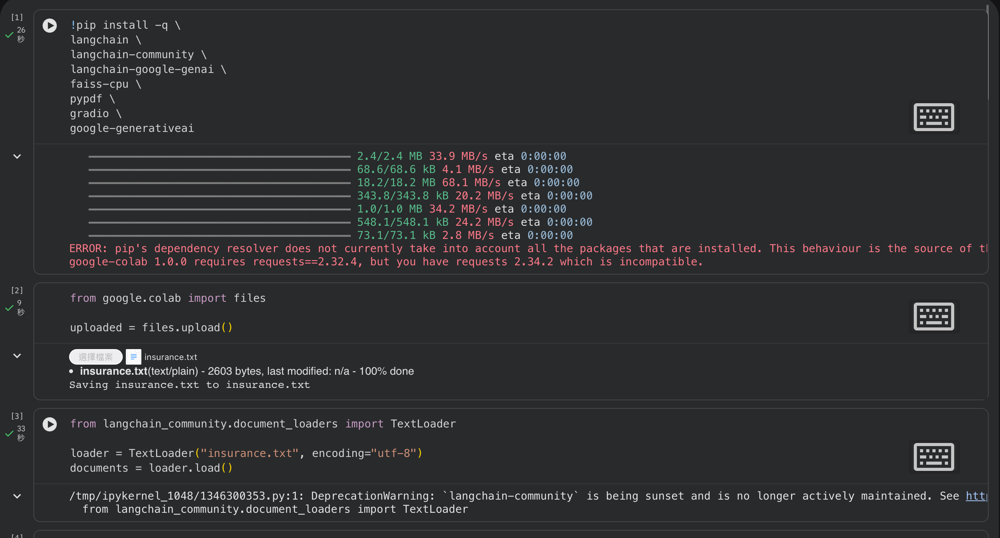
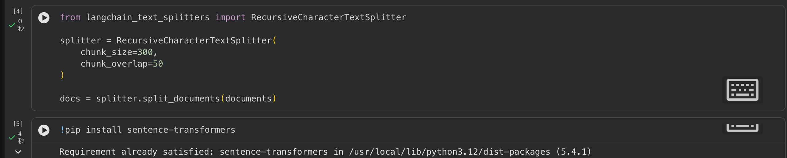
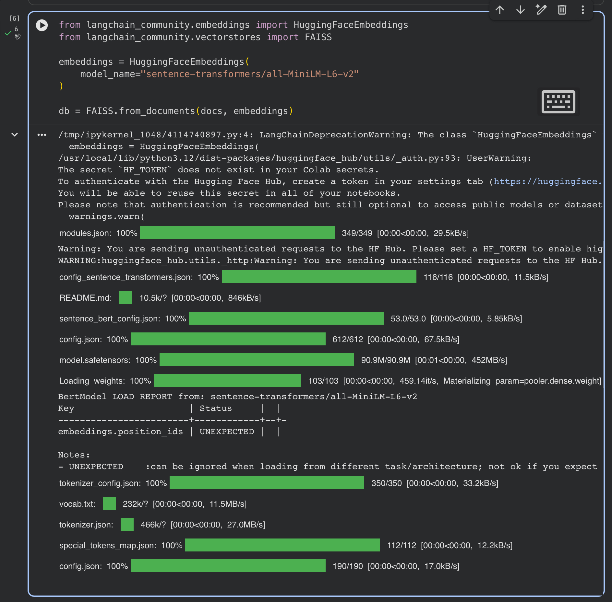
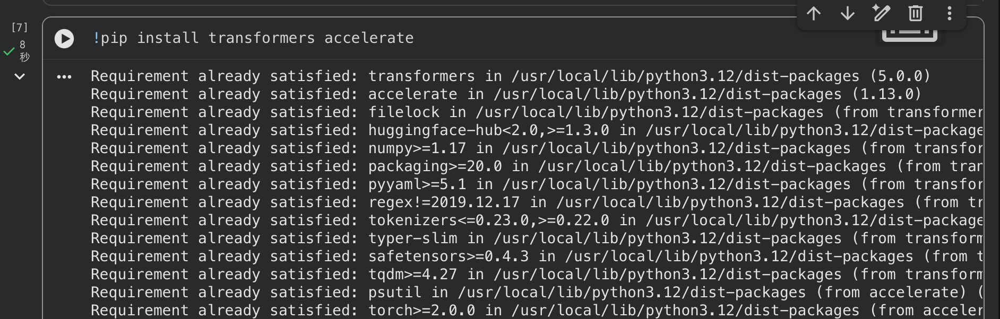
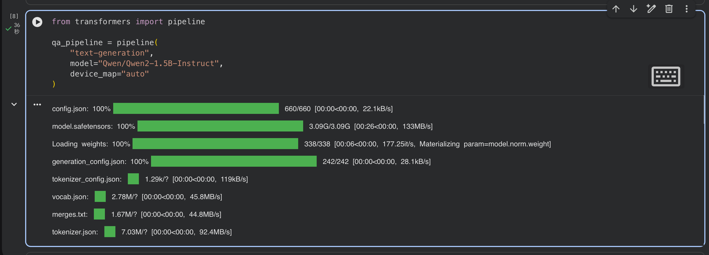
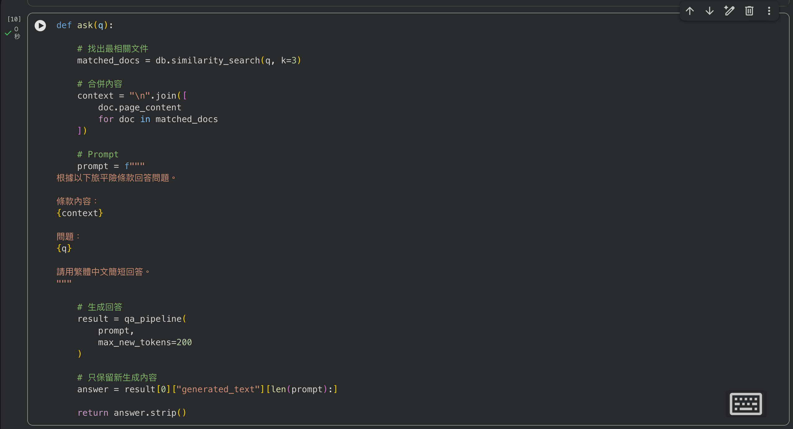
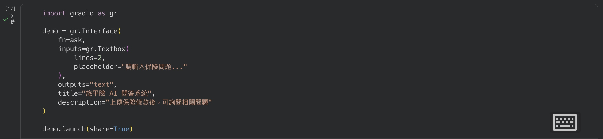
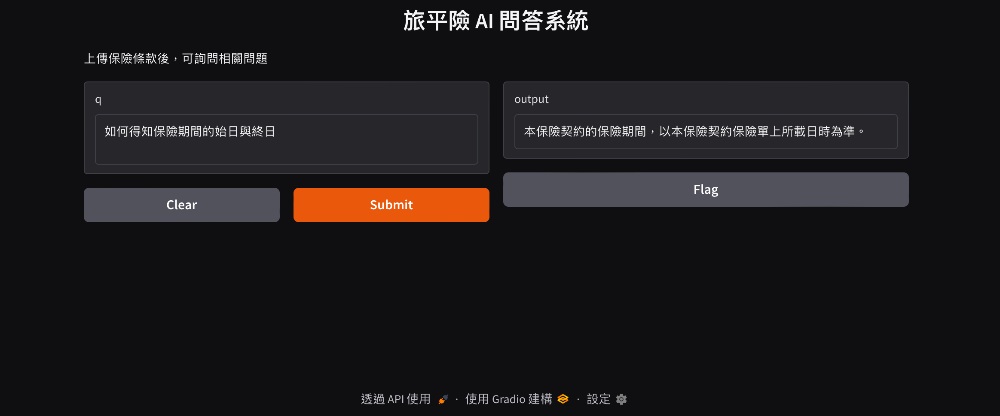

# 旅平險 AI 問答系統

使用 LangChain、FAISS 與 Qwen 建立的 RAG（Retrieval-Augmented Generation）旅平險問答系統。

---

## 專題介紹

本專題可讀取旅平險條款文件，並利用大型語言模型回答使用者問題。

系統會：

1. 讀取保險條款
2. 切分文字內容
3. 建立向量資料庫
4. 搜尋相關條款
5. 使用 AI 生成答案

---

## 使用技術

- Python
- LangChain
- FAISS
- HuggingFace Embeddings
- Qwen2-1.5B-Instruct
- Google Colab
- gradio

---

## 使用保單
- 國泰產險海外旅遊險（節錄）

---

## 如何進行預測結果的正確性驗證

驗證程式：
```
correct = 0

for item in test_data:

    pred = ask(item["question"])

    if item["answer"] in pred:
        correct += 1

accuracy = correct / len(test_data)

print("Accuracy:", accuracy)
```

本系統透過 RAG 架構，
限制模型根據檢索到的條款回答，
降低大型語言模型幻覺問題。


## 安裝套件

```bash
pip install langchain
pip install langchain-community
pip install langchain-google-genai
pip install faiss-cpu
pip install pypdf
pip install gradio
pip install google-generativeai
pip install sentence-transformers
pip install transformers accelerate

```
## Colab執行過程








## 網頁demo




